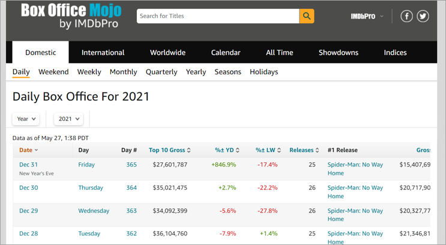
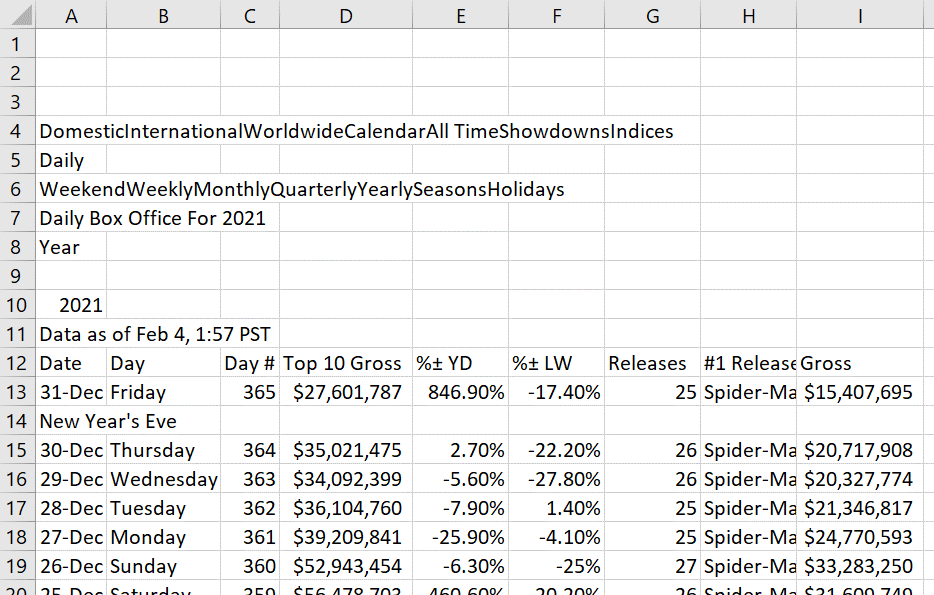

```{r setup, include=TRUE}

# this line specifies options for default options for all R Chunks
knitr::opts_chunk$set(echo=T, 
                      highlight=T)

# suppress scientific notation
options(scipen=100)

# install helper package (pacman) if needed
if (!require("pacman")) install.packages("pacman", repos = "http://lib.stat.cmu.edu/R/CRAN/")

# install and load required packages
# pacman should be first package in parentheses and then list others
pacman::p_load(pacman, tidyverse, gridExtra, magrittr, lubridate, 
               knitr, kableExtra)

# verify packages (comment out in finished documents)
p_loaded()

```

---

### Reminders:

#### HW 2 is Due 9/14

Recommended Textbook: A [list of useful sections can be found here](https://docs.Google.com/spreadsheets/d/1yhUSJAJQ4VVjVBpiv3_C2D3tQs2SmJjynSq9chqXOwc/edit?usp=sharing) and will be updated as the course progresses.


#### Reminders from Week 2 and HW 2:

#####`dplyer` commands:

- `select`  - used to select variables (columns) of a dataset
- `slice`   - used to select rows by row number
- `filter`  - used to filter data rows by values of a variable
- `mutate`  - to create or transform a variable
  
##### `ggplot` introduction:

- basic syntax and aesethetics statements (`aes`)
- creating a basic boxplot (`geom_boxplot`) or scatterplot (`geom_point`)
- removing default background by modifying the theme
- adding a a third categorical variable to color the data by category
  
---

### New Skills in Week 3 (and HW 3)

- Importing a 'clean' dataset
    - After Quiz 1 we'll cover how to clean 'messy' data 

- Creating a character or factor variable
  
- Coercing data to be a new data type
  
- Summarizing data and reshaping data for a summary table
  
- Reshaping data for a plot

  
#### Preview of 'cleaning' messy

- Examine Raw Messy Data
   - remove non-data rows at the top with skip
   - select variables and filter data rows
   - remove nuisance characters like `$` and `,`
   - work with date information variables
   - export and save a clean dataset

---

### Original Data

Online Data are often formatted for viewing, not using.

- Details that make online data viewing easier, have to be removed for data management.

.center[




[Data Source: Box Office Mojo](https://www.boxofficemojo.com/daily/2021/?view=year)

---

### Raw Data (.csv)

Copying data from a website and saving them as a .csv file (CSV UTF-8) removes most of the formatting, but data cleaning is still required.

{height=65%}

---

### Import, Select, Filter

- `read_csv` imports the raw data and skips the first 11 rows (above the variable names).

- `filter` is used to filter out rows that don't contain data

- `select` is used to select only the variables we need

- `rename` (new command) is used to make the variable names easier to work with

- `head` is one of many options for examining the data

```{r}

bom21 <- read_csv("box_office_mojo_2021.csv", skip=11, show_col_types = FALSE) |>
  filter(!is.na(Day)) |>
  select(Date, `Top 10 Gross`, Gross, Releases, `#1 Release`) |>
  rename(date=Date, top10gross = `Top 10 Gross`, 
         num_releases=Releases, num1gross=Gross, num1 = `#1 Release`) 
head(bom21)

```

---

### Clean Numeric Data

- The two **Gross** variables both contained `$` and `,` symbols that were removed with `gsub`.

- Each variable was then converted to numeric with `as.numeric`.

```{r clean numeric variables}
bom21 <- bom21 |>
  mutate(top10gross = gsub(x=top10gross, pattern="$", replacement="", fixed=T),
         top10gross = gsub(x=top10gross, pattern=",", replacement="", fixed=T) |> 
           as.numeric(),
         
         num1gross = gsub(x=num1gross, pattern="$", replacement="", fixed=T),
         num1gross = gsub(x=num1gross, pattern=",", replacement="", fixed=T) |> 
           as.numeric())
head(bom21)
```

---
### Date Variables

- Dealing with date variables used to be much more difficult (prior to `lubridate` package).

   - Dates are still troublesome in most other software
   
- Below we create a date variable from the provided character variable, create other variables, examine data and export the dataset.

```{r date variables modified with lubridate}
bom21 <- bom21 |>
  mutate(date = dmy(paste(date,"-","2021")), # year is required so we paste it (add it as text) to each date
         month = month(date, label=T, abbr=T),
         day = wday(date, label=T, abbr=T),
         quart = quarter(date)) |>
  select(date, month, day, quart, top10gross:num1) |>  # select and reorder variables
  glimpse() |>                                         # examine data
  write_csv("Box_Office_Mojo_Week3_HW3.csv")           # export using write_csv
```

---

### Importing Clean Data

- `read_csv`  is used in this class 

- External datasets should be saved as `.csv` files to your `code_data_output` folder

  - There are many CSV file options.  
  
  -  Select **CSV UTF-8** when saving Excel datasets as `.csv` files.

- `show_col_types=F` suppresses the output message from importing data

  - This option will be required when you create a dashboard.
  
```{r import and examine cleaned data}
mojo_21 <- read_csv("Box_Office_Mojo_Week3_HW3.csv", show_col_types=F) |>
  glimpse(width=60)

```


---

### Week 3 In-class Exercises (TP L5 - Q1)

***TurningPoint Session ID: bua455s22***

Notice that in the prior chunk, we use the command `read_csv`

**True or False:** 

`read_csv` and `read.csv` are the same and can be used interchangeably to import data.

**Hint** Two ways to determine this:

1. R help: In console type ?read_csv and/or type ?read.csv and look through documentation

2. Google **R read_csv and read.csv**

<br>

**Note:** R help files are sometimes hard to decipher and **Googling** often requires time an effort but both are essential to learning to code and manage data independently.

---

### Categorical Data Management

This data set is **ALMOST** ready to work with BUT there are few tasks we will cover:

- select all variables in dataset EXCEPT **`num1`** (name of number 1 movie)

  - We will work with text (character) variables after Quiz 1

- Convert `month` to an ordinal factor, `monthF`

- Convert `day` (of the week) to an ordinal factor, `wkdayF`, with Monday as 1st Day 

   - Change `wkdayF` labels to be `M, T, W, Th, F, Sa, Su`

- Convert quart (Quarter) to an ordinal factor with text labels (HW 3)

<br>

In HW Assignment 3:

- You will create a factor variable **`quartF`** with 

   - levels:  1,2,3,4

   - labels: "1st Qtr", "2nd Qtr", "3rd Qtr", "4th Qtr" 
   
- Create a publication quality table showing data by week day and quarter.

---

### Exclude `num1`

Recall that we use `!` to exclude a variable or filter out observations

```{r excluding a variable}

mojo_21_mod <- mojo_21 |>            # save as new dataset 
  select(!num1) |>                   # excludes text variable num1 #<<
  glimpse()

```


---

### Create factor variables

The `factor` command is used with `mutate` to create **TWO** factor variables
- `levels` option specifies **order**
- `labels` option specifies **appearance of values** 

```{r creating factor variables}
mojo_21_mod <- mojo_21_mod |> 
  mutate(monthF = factor(month,     
                         levels=c("Jan", "Feb", "Mar", "Apr", "May", "Jun",
                                  "Jul", "Aug", "Sep", "Oct", "Nov", "Dec")),
         wkdayF = factor(day,     
                         levels=c("Mon", "Tue", "Wed", "Thu", "Fri", "Sat", "Sun"),
                         labels= c("M", "T", "W", "Th", "F", "Sa", "Su"))) |>
  glimpse()

```

]

---

### Examine New Factor Variables

We can use `unique` or `summary` to examine the new variables `monthF` and `wkdayF`

- `unique` lists the levels (categories) in the specified order

- `summary` of a factor variable shows the number of observations in level (category)


```{r examine factor variables unique and summary}

mojo_21_mod |> pull(monthF) |> unique()
mojo_21_mod |> pull(wkdayF) |> unique()
mojo_21_mod |> select(month, monthF, day, wkdayF) |> summary()

```

---

##3 Numerical Data Management

- The `mutate` command can contain many separate statements.

- **Good practice:** Subdivide data management tasks into multiple chunks so that each chunk is easily understood

In the next chunk we will:

- **modify `top10gross` and `num1gross`**

  - We divide these variables by `1000000` and `round` them for presentation purposes

- **create a percent variable** that reflects the percent of top 10 gross that was earned by number 1 film (HW 3)

   - This value will be rounded to 2 decimal places

   - Within `mutate` command (with piping): `pctnum1 = (num1gross/top10gross * 100) |> round(2)`
     
- **convert `num_releases` to an integer (HW 3)**
     
  - If data are discrete (countable), the data type should be integer
  
  - When doing a simple conversion, it is okay to overwrite original variable.
  
  - Within `mutate` command: `num_releases = as.integer(num_releases)`

---

### R code for Numerical Data Management

**Note:** Variables are rounded to two decimal values by using piping and `round(2)`

```{r numerical data management}
mojo_21_mod <- mojo_21_mod |>
  mutate(top10grossM = (top10gross/1000000) |> round(2),  # change scale and round
         
         num1grossM = (num1gross/1000000) |> round(2),
         
         num1pct = (num1gross/top10gross * 100) |> round(2), # create rounded pct var
         
         num_releases = as.integer(num_releases)) |> # converts num_releases to integer 
  
  select(date, monthF, wkdayF, quart, num_releases, num1gross, num1grossM, 
         top10gross, top10grossM, num1pct)

head(mojo_21_mod)
```

---

class: middle

### Week 3 In-class Exercises (TP L5 - Q2)

***TurningPoint Session ID: bua455s22***

**This is BB Question 2 in HW 3**

The correct command used to convert a numeric variable to an integer variable is

`____()`.

When you **`glimpse`** the data after Part 2 (Chunk 3) in HW 3, the type for the **`num_releases`** variable is shown as 

`<____>` instead of ***`<dbl>`***.


---

### Summarizing Data

- We will summarize data and then reshape it for a summary table.

  - R commands `group_by` and `summarize` allow us to summarize the data by category

- When summarizing data, it is easier to select the variables you want first.

- Plan what you want to do

```{r group and summarize}

mojo_21_smry <- mojo_21_mod |>
  select(monthF, wkdayF, top10grossM) |>
  group_by(monthF, wkdayF) |>
  summarize(avg_top10gross = mean(top10grossM, na.rm=T),
            mdn_top10gross = median(top10grossM, na.rm=T)) |>
  glimpse()

```


---


### Reshape Data using `pivot_wider`

- A common task in data management is reshaping data

- Dislay data tables must be compact for presentation

```{r reshape data using pivot_wider}
mojo_21_wide <- mojo_21_smry |>
  pivot_wider(id_col=monthF, names_from=wkdayF, values_from=mdn_top10gross) |>
  rename(Month = monthF)
head(mojo_21_wide)
```


---

### Creating Tables for Presentation

Below are two options for for displaying a small dataset in tabular formats.


- **Note:** Appearance of default kable tables differs for slides, word documents, and html files

#### Basic Table with `kable` 

```{r filter select and present data}

mojo_21_fall_wknd <- mojo_21_wide |>
  select(Month, F, Sa, Su) |> 
  filter(Month %in% c("Sep", "Oct", 
                      "Nov", "Dec"))
mojo_21_fall_wknd |>
  kable()
```


#### `kable` Table with styling

```{r modifying table alignment and styling}
mojo_21_fall_wknd |>
 kable(align="lccc", 
       caption="Median Fall `21 Top 10 Weekend Gross") |>
  kable_styling(full_width = F)

```


---

### Reshaping Data using `pivot_longer`

- The longer data format is often needed for efficient data visualization

.pull-left[
#### `pivot_longer` R code

```{r pivot longer R code}
mojo_21_long <- mojo_21_wide |>
  pivot_longer(cols=M:Su, names_to="Day", 
               values_to="med_top10gross") 
head(mojo_21_long, 10)
```


#### basic `geom_bar` barplot R code

```{r basic stacked barplot, fig.dim=c(5,4)}
(mojo_barplot <- mojo_21_long |> ggplot() + 
  geom_bar(aes(x=Month, y=med_top10gross, fill=Day), 
           stat="identity"))
```

---

### Stacked Barplot

```{r stacked barplot no background, fig.dim=c(8,5), fig.align='center'}
mojo_21_long <- mojo_21_long |> # Day converted to factor to specify order
  mutate(Day = factor(Day, levels=c("M", "T", "W", "Th", "F", "Sa", "Su")))
(mojo_barplot <- mojo_21_long |> 
  ggplot() + 
  geom_bar(aes(x=Month, y=med_top10gross, fill=Day), stat="identity") + 
  theme_classic())
```

---

### Side-by-side Barplot

```{r side by side barplot, fig.dim=c(12,5), fig.align='center'}
(mojo_barplot <- mojo_21_long |>
  ggplot() + 
  geom_bar(aes(x=Month, y=med_top10gross, fill=Day), 
           stat="identity", position="dodge") + 
  theme_classic())
```

---

### Labels Formatted

Now we can add on to the plot which is a saved object in the Global Environment

```{r adding label formatting to barplot, fig.dim=c(12,5), fig.align='center'}
(mojo_barplot <- mojo_barplot +
  theme(legend.position ="bottom") +
  guides(fill = guide_legend(nrow = 1)) +
  labs(x="", y="Median Daily Gross ($M)",
       title = "Median Daily Gross of Top 10 Films by Month and Day of Week",
       caption = "Data Source: www.boxofficemojo.com"))
```

---

### Spectral Palette with Text Resized

```{r final plot with spectral palette and text size adjusted, fig.dim=c(12,5), fig.align='center'}
(mojo_barplot <- mojo_barplot + 
    scale_fill_brewer(palette = "Spectral") +
    theme(plot.title = element_text(size = 20),
        axis.title = element_text(size=18),
        axis.text = element_text(size=15),
        plot.caption = element_text(size = 10),
        legend.text = element_text(size = 12),
        plot.background = element_rect(colour = "darkgrey", fill=NA, size=2)))
```

---

class: middle

### Week 3 In-class Exercises (TP L5 - Q3)

***TurningPoint Session ID: bua455s22***

**This is part of BB Question 5 in HW 3**

If you want a grouped barplot with **side-by-side bars**, what is the correct option to include in the **`geom_bar`** statement?

**[Here is some additional information about geom_bar barplots.](https://ggplot2.tidyverse.org/reference/geom_bar.html)** 

---

### `pivot_longer` for Line Plots and Areas Plots

- An alternative to summarizing the data is to show the data as a time series.

  - Two ways to do this are a **line plot** or an **area plot**

  - These plots are an effective data management and presentation tool.

- To make a line plot with multiple variables, we use pivot_longer to reshape the data.

```{r reshape data for a line plot}
mojo_21_line_area <- mojo_21_mod |>
  select(date, top10grossM, num1grossM) |>                  # select variables
  rename(`Top 10` = top10grossM, `No. 1` = num1grossM) |>   # rename for plot
  pivot_longer(cols=`Top 10`:`No. 1`,                       # reshape data  
               names_to = "type", values_to = "grossM") |>
  mutate(type=factor(type, levels=c("Top 10", "No. 1")))    # convert type of gross to a factor
head(mojo_21_line_area, 4)

```

---

### Line Plot

```{r basic line plot code, fig.dim=c(14,4), fig.align='center'}
(line_plt <- mojo_21_line_area |>
  ggplot() + 
  geom_line(aes(x=date, y=grossM, color=type), size=1) + # two lines created #<<
  theme_classic())
```


---

### Labels & Colors Formatted

```{r line plot with labels formatted, fig.dim=c(14,5), fig.align='center'}
(line_plt <- line_plt + 
  theme(legend.position="bottom") +                    # legend at bottom #<<
  scale_color_manual(values=c("blue", "lightblue")) +  # specify colors   #<<
  labs(x="Date", y = "Gross ($Mill)", color="",
       title="Top 10 and No. 1 Movie Gross by Date", 
       subtitle="Jan. 1, 2021 - Dec. 31, 2021",
       caption="Data Source:www.boxoffice.mojo.com"))
```

---

### Resize Text

```{r line plot with text size adjusted, fig.dim=c(14,5), fig.align='center'}
(line_plt <- line_plt +
  theme(plot.title = element_text(size = 20),
        axis.title = element_text(size=18),
        axis.text = element_text(size=15),
        plot.caption = element_text(size = 10),
        legend.text = element_text(size = 12),
        plot.background = element_rect(colour = "darkgrey", fill=NA, size=2)))
```

---

### Complete Area Plot Code

Change `geom_line` to `geom_area` and `color` to `fill`

```{r convert line plot to area plot}
(area_plt <- mojo_21_line_area |>
  ggplot() + 
  geom_area(aes(x=date, y=grossM, fill=type), size=1) + # changed to geom_area and color to fill #<<
  theme_classic() + 
  theme(legend.position="bottom") +                    
  scale_fill_manual(values=c("blue", "lightblue")) +    # changed color to fill   #<<
  labs(x="Date", y = "Gross ($Mill)", color="",
       title="Top 10 and No. 1 Movie Gross by Date", 
       subtitle="Jan. 1, 2021 - Dec. 31, 2021",
       caption="Data Source:www.boxoffice.mojo.com") + 
    theme(plot.title = element_text(size = 20),
        axis.title = element_text(size=18),
        axis.text = element_text(size=15),
        plot.caption = element_text(size = 10),
        legend.text = element_text(size = 12),
        plot.background = element_rect(colour = "darkgrey", fill=NA, size=2)))
```

---

### Week 3 In-class Exercises (L6 - Q1)

***NOT ON TurningPoint***

**Practice:**

- Running chunks and exporting a table.

- Export the small summary dataset from Lecture.
- **Preview for 1 Question in Quiz 1 where you will:** 
  - Select variables from a provided dataset
  - Group and summarize data
  - Export a summary table as a .csv file and submit it.

**Instructions:** 

1. Save Week 3 R project to your computer 
2. Open this project by clicking on .Rproj file
3. Open .Rmd file within open R project.
4. Run all chunks above this exercise
5. Modify the following chunk below to:  
    i. Round all values in columns 2-4 of `mojo_21_fall_wknd` to 1 decimal place using `round`.  
    ii. Export `mojo_21_fall_wknd` as a `.csv` file with your name.  
6. Submit this .csv file with your name in the [Week 3 In-class Exercise on Blackboard](https://blackboard.syracuse.edu/webapps/assignment/uploadAssignment?content_id=_8377476_1&course_id=_475626_1&group_id=&mode=cpview) 

**NOTE: **This counts as part of your in-class participation for the Week 3 lectures.

---

### R Code Chunk for In-class Exercise (L6 - Q1)

0. Optional Remove `, eval=F` from chunk header. This will allow code in chunk to run when it is rendered.

1. Remove the `#` and complete `round` command to round numeric columns (columns 2 - 4) to 1 decimal place.

2. Choose EITHER of the `write_csv` commands and edit it so dataset will be exported to `code_data_output` folder with your name.

3. Delete `write_csv` command you don't edit or put `#` symbols in front of it.

4. Submit `.csv file` with your name


```{r round and export summary dataset, eval = F}

# examine data with glimpse
mojo_21_fall_wknd |> glimpse()

# rounding columns 2, 3 and 4 only
# mojo_21_fall_wknd[,2:4] <- round()
  
# export summary dataset using write_csv without piping
write_csv(mojo_21_fall_wknd, "Movie_Gross_Fall_2021_Weekends_FirstName_Last_Name.csv")

# export summary dataset using write_csv with piping
mojo_21_fall_wknd |>
  write_csv("Movie_Gross_Fall_2021_Weekends_FirstName_Last_Name.csv")

```

---

class: middle

### Week 3 In-class Exercises (L6 - Q2)

***NOT ON TurningPoint***

If all the columns in a dataset are numeric, you can round the whole dataset at once with the command `round(<name of dataset>)`.

Why wouldn't that work for the dataset in the previous exercise, `mojo_21_fall_wknd`?

<br>

Hint: To answer this question, you are encourage to 

- try running the command `round(mojo_21_fall_wknd)` 

- examine the data using `glimpse` 

---

class: middle

### Week 3 In-class Exercises (TP L6 - Q3)

***TurningPoint Session ID: bua455s22***

Which of the following commands should **NOT** be used within a `mutate` command or a `summarize` command?
  
- `as.integer`

- `factor`

- `mean`

- `filter`

---

### HW 3 Introduction

#### Purpose

This assignment will give you experience with:

- Creating an R Project Directory and a code_data_output folder (Review)

- Creating, saving, using an R Markdown file (Review)

- Importing data

- Knitting an R Markdown file to create an word document (Review)

- Creating a README file (Review)

- Using the dplyr commands along with commands to reshape and summarize data

- Creating plots with some formatting

---

class: middle

In HW 3, you will group the data by quarter and week day. This is Part 4 of HW 3 and is very similar to the group_by and summarize code covered in Lecture 5.

### Week 3 In-class Exercises (TP L6 - Q4)

***TurningPoint Session ID: bua455s22***

**This is BB Question 3 in HW 3**

Your grouped and summarized dataset, **`mojo_qtr_smry`**, has

`____` rows and

`____` columns

`____` summary numeric variables

---
### **Key Points from Week 3**

**Summarizing Data by Group**

- Use `group_by` to specify grouping variables

- Followed by `summarize`

   - Within summarize specify type:
   
   - .e.g. `mean`, `meadian`, `max`, etc.
   
<br>

**Reshaping Data for Different Purposes**

- `pivot_wider` is useful for display tables

- `pivot_longer` is useful for plots

<br>

**Plotting Data**

- grouped barplots (stacked and side-by-side)

- line plots and area plots

<br>

**You may submit an 'Engagement Question or Comment' about Week 3 lectures until Thursday, 9/15, at midnight on Blackboard.**

